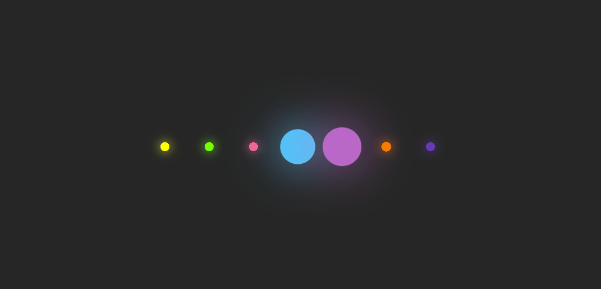
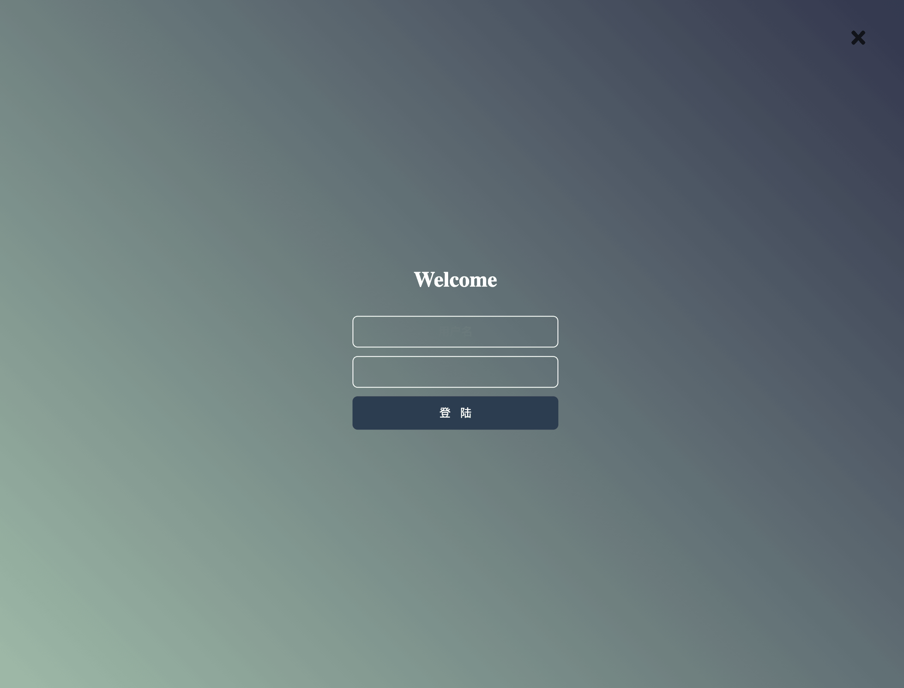

# widget list

## ColorfulBg

> 动态渐变背景

## ColorfulButton

> 幻彩按钮

## MagicFont

> 图片背景文字

## MagicLoading

> 旋转炫彩 loading

## MagicShare

> 滚动分享条

## RhythmLoading

> 韵律动画 loading

## ShareList

> 社交分享列表

## ShineBox

> 炫彩文字卡片

## SimpleLogin

> 简洁登录框

